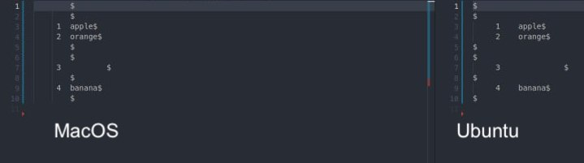

# School-21 💻

Репозиторий для хранения моих проектов основного обучения Школы 21 и документаций к ним

## SimpleBashUtils

Этот проект представляет собой имплементацию базовых команды Unix систем: ```cat``` и ```grep```

## Установка и настройка проекта 🔧

### 1. Склонируйте репозиторий с github
```.sh
git clone <https://.git>
```

### 2. Скомпилируйте файлы утилит 

*исполняйте команды из корня проекта*

Команды для компиляции объектного файла для ```cat```:

```.sh
❯ cd src/cat
❯ make s21_cat
# для удаление объектного файла используйте rm s21_cat
```

Команды для компиляции объектного файла для ```grep```:

```.sh
❯ cd ../grep
❯ make s21_grep
# для удаление объектного файла используйте rm s21_grep
```

### 3. Проверка правильности работы утилит

```cat```:

```.sh
❯ cd src/common/cat_test
❯ gcc cat_test.c
❯ ./a.out
```

```grep```:

```.sh
❯ cd src/common/grep_test
❯ gcc grep_test.c
❯ ./a.out
```

Если во всех тестах при запуске объектных файлов было написано **Файлы идентичны**, то утилиты работают корректно и ими можно пользоваться 🤗

---

❗️ Стоит упомянуть, что данный проект, будет по-разному отрабатывать на разных ОС, в частности, на MacOS и Linux. Связано это с этим, что ОС используют разные реализации библиотеки regex.h, в случае с ```grep```, и самих утилит, в случае с ```cat```.

### Различия имплементации cat

 

 Как можно видеть из фотографии, то на MacOS при запуске ```cat -b -e \[filename\]``` знаки переноса строки `$` индетируются на 6 пробелов вместе с остальным текстом, а на Linux Ubuntu `$` пишутся в начале строки.

 Также, команда ```cat -v``` будет по-разному отрабатывать, так как OSX и Linux используют разные кодировки, поэтому на маках некоторые специальные элементы не будут заменяться даже нативной командой ```cat```.

 ### Различия имплементации grep

 Для правильной работы grep на OSX нужно всегда передавать в ```regсomp``` флаг ```REG_EXTENDED```, в противном случае даже компиляция более чем двух переданных регулярных выражений не будет выполняться правильно, что приведет к пустому выводу утилиты. Также, при парсинге комбинированного паттерна для компиляции ```regex``` нельзя экранировать символы ```|```, так как они не будут распознаваться (при наличии ```REG_EXTENDED``` или что есть то же самое, что передавать в ```grep``` флаг ```-E```, не требуется экранирование символов, поэтому следующая команда ```[0-9]\+``` будет работать на Linux, но не на OSX)

---